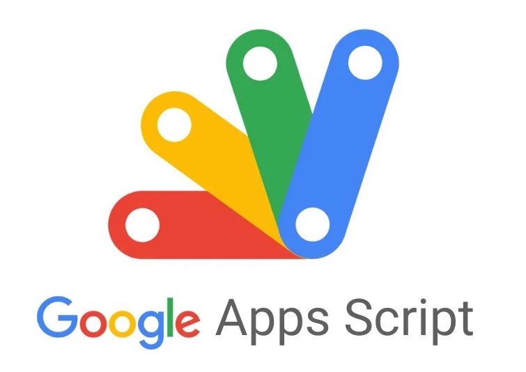

# 🥤 Drink Order App 訂飲料小幫手



一個基於 Google Apps Script 的團購飲料系統。

## ✨ 功能
- **多店家支援**：可輕鬆切換不同飲料店菜單 (目前內建五十嵐、可不可、五桐號、大苑子、迷客夏)。
- **自動化試算表**：訂單自動傳送到 Google Sheets，每日/每店家自動分頁。
- **客製化選項**：支援甜度、冰塊、加料、飲品敘述等細項設定。

## 🚀 快速開始

### 1. 安裝依賴
你需要安裝 Node.js 以及 Clasp。
```bash
npm install -g @google/clasp
```

### 2. 登入 Google
```bash
clasp login
```

### 3. 設定專案
請依照以下步驟設定 `.clasp.json`：

1. 複製範例設定檔：
   ```bash
   cp .clasp.json.example .clasp.json
   ```
2. 前往 [Google Apps Script](https://script.google.com/) 建立一個新專案。
3. 取得 **Script ID** (在 專案設定 > ID)。
4. 打開 `.clasp.json`，將 `scriptId` 替換成你的 ID。

### 4. 部署
```bash
clasp push
clasp deploy
```
部署完成後會獲得一組網址，即可分享給朋友使用！

## 🛠 進階工具

### 圖片轉換工具 (`convert_images.js`)
由於 Google Apps Script 環境限制，建議將圖片轉為 Base64 字串後嵌入。本專案提供轉換工具：
1. 將圖片放置於 `menu/` 目錄。
2. 執行轉換指令：
   ```bash
   node convert_images.js
   ```
3. 轉換後的 Base64 字串將產生成 `.txt` 檔案於 `base64/` 目錄，請手動複製內容至 `Images.js` 使用。

## 🎨 如何新增菜單
編輯 `Menus.js`：
```javascript
{
  "id": "你的店家ID",
  "name": "店家名稱",
  "style": { ... }, // 設定配色、Logo、菜單圖
  "categories": [ ... ] // 設定品項、價格、敘述
}
```
